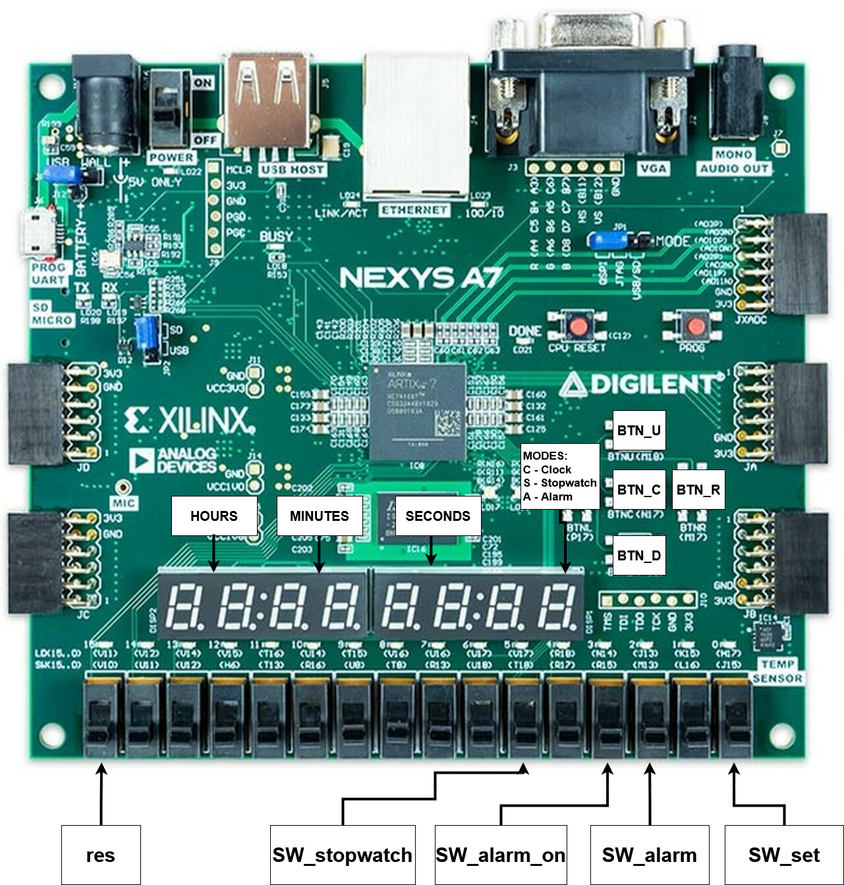
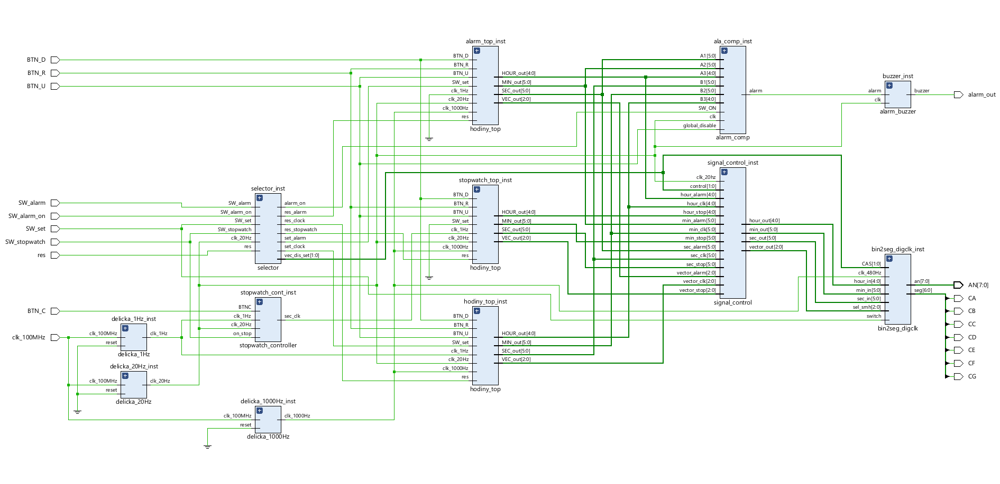
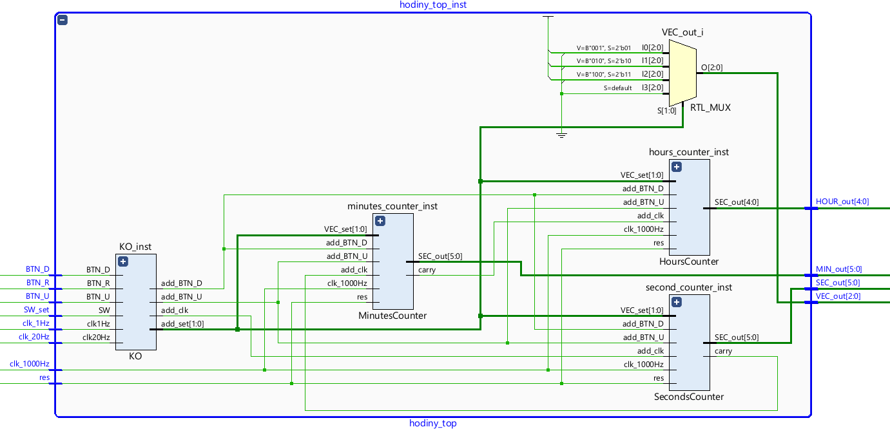
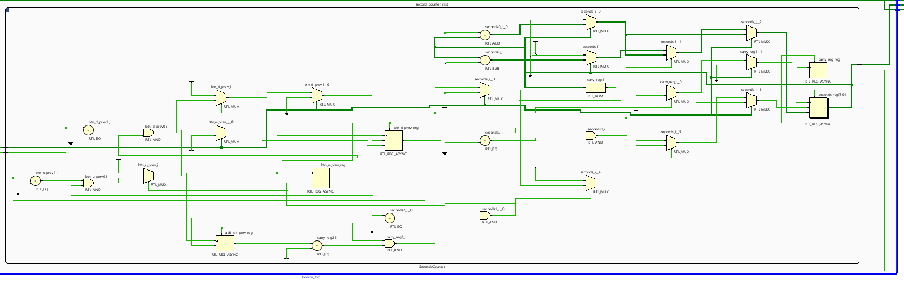
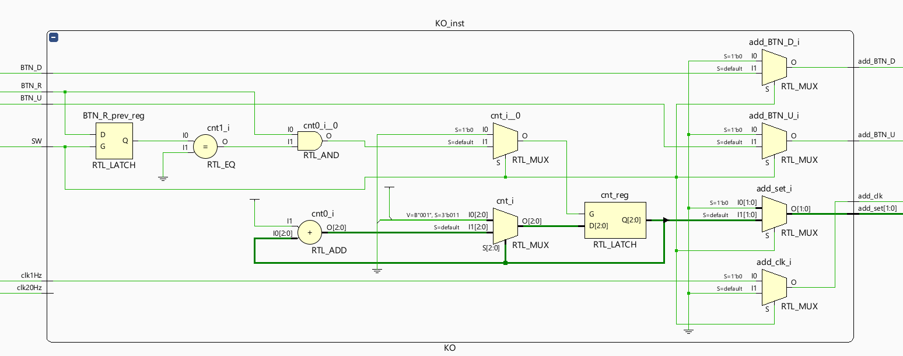
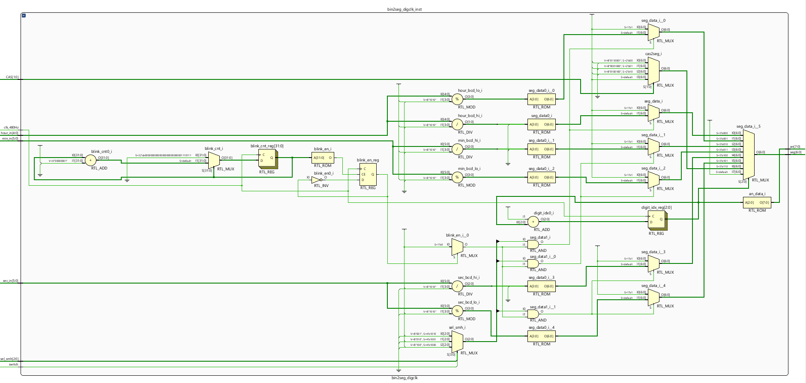
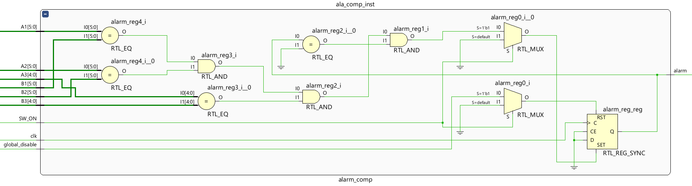
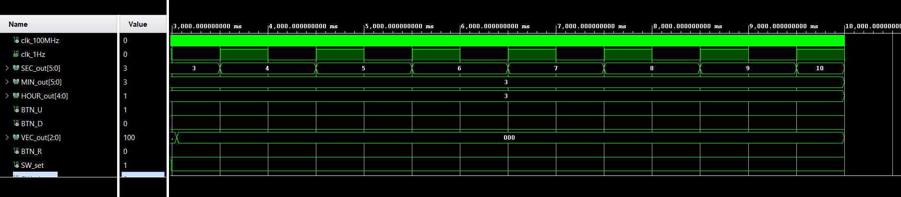
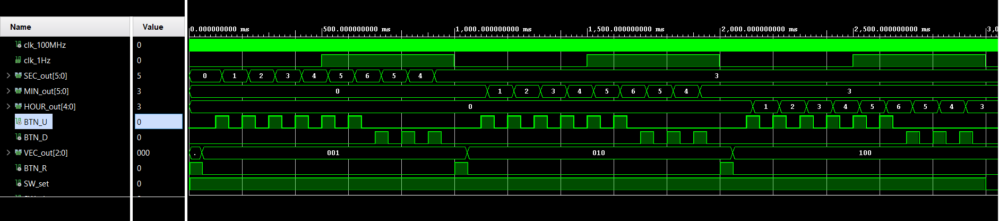

# Digital-clock

## Team members
* Mezera Vojtěch
* Moravec David
* Pavlíček Michal
* Mostecký Filip

## Abstract
Main objective of this project was to implement functional digital clock with stop watch and alarm clock on development board Nexys A7-50T in VHDL. Upon startup, the system defaults to digital clock mode, and the 7-segment display begins counting from zero.

If user wishes to manually change time, he can flick the switch "SW_set" to on position and with BTN_R button choose if he wants to change hours/mins/secs. Then with buttons BTN_U or BTN_D he may increase or decrease the time unit showed on 7-segment display. To save the set time, simply flick the switch "SW_set" to off position. To reset the time to default, simply flick the "res" switch to on and off postion.

If user wants to turn on stopwatch, simply put "SW_stopwatch" switch to on position. The stopwatch control is as follows: Button BTN_C is for starting and resuming the timer, to reset the timer completly, flick the "res" switch on and off.

To set the time on the alarm clock, user has to set the "SW_alarm" switch to on position. Then setting time, when the alarm will go off, is the same as manually changing time in digital clock, as described above. To turn on the alarm clock, user has to enable "SW_alarm_on" switch.

## Assignment of functions to components 

### Example of the seconds counter overflow

### Example of the reset functionality

### Example of stopwatch functionality

### Top_Level schematic

fmdbfdkfd

### Hodiny_top schematic

gdgdgf

#### Seconds_counter schematic

gdgdgf

#### KO schematic

gdgdgf

### BIN2SEG schematic

This block is used for visual output of the clock. There are four key features. Converting the time from binary to binary-coded decimal, displaying the time on the 7-segment display, displaying the current mode and blinking feature for indication of setting the time.
First, the corresponding number displayed is assigned to each number in BCD format as well as the mode indication CAS. Then there is enabling the blinking while setting function using clock signal. Then the conversion from binary to BCD takes place. Dividing the numbers to tens and units. The multiplexing overwrites the displays using clock signal, it is done fast enough to be unnoticeable by human eye. Lastly the numbers are displayed on corresponding displays.

### Alarm_comp_schematic

gdgdgf

### Top_level simulation - Automatic mode

sgd

### Top_level simulation - Manual mode

